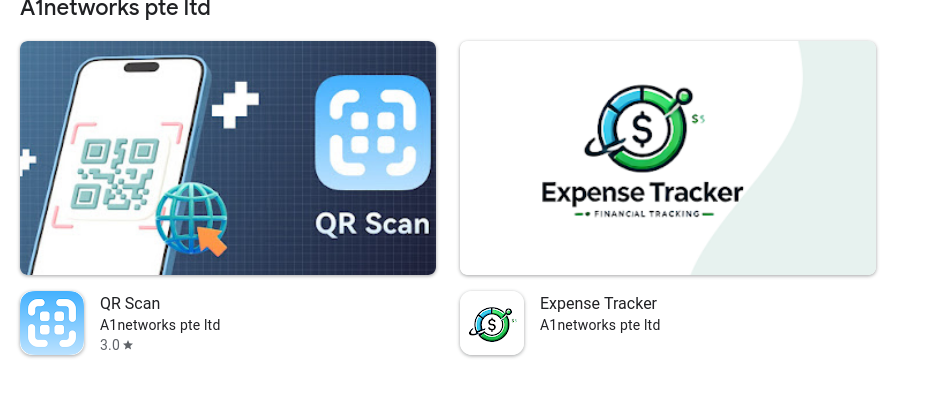

Nowadays I have begun to see an uptick in adwares polluting consumer's android devices. I don't know the exact initial entry point upon which the user is instructed to install the malicious app, but a common theme is that every single adware is hosted on Google Play.
When "Play Protect" feature first came out, the amount of apps that had this type of behavior were significantly reduced if not extinct, but whichever method these malwares use manages to avoid Play Protect's wrath to this date.
Whenever I encounter such malware, I immediately report the app to the Google Play for obvious reasons but I don't think they are keen on actively handling this issue.
To date there are two variants I have encountered, one is less evasive in android.

### Type A

Spawns a new window, displays a fullscreen window and plays the ad, the ads shown are either belong to legitimate businesses or fearmongering to install another adware,

* The background service has a blank name, blank icon and no content, shows up in status bar as an empty column
* When user opens the "Recents" in android, the installed package is masquaraded as a legitimate app (i.e Google Voice)
* User is able to uninstall the app directly via navigating to the package information from recents

### Type B
Behaviour is similar to Type A, however:
* Sometimes there won't be an indicator of service, not even an empty column in the notifications
* App is able to intercept if the user wants to go into "Recents" and kill the window to hide itself
* More aggressive when it comes to the delay between displaying ads

## The Good, the Bad and the Slop
Today's case came with three of these A type adwares installed onto their Samsung device. I swiftly deleted one with package name "Recorder" which I regret. The other two I managed to get their package names and which apps they originate from

### The bad
Our second instance is called "QR Scan" with the package name "com.qrscanner.qrueser", the app reported itself as "Google Voice" in installed packages

It should be noted that the app has more than 500.000 downloads (possibly through deceptive advertising), which would generate more revenue than your average monetized YouTube video. Users were also quick to report this behavior yet the app remains.

_it's almost june_

For what it's worth, there was an actual human trying to design the app's UI and screenshots, which can be noted via the poor positioning and inconsistencies in the screenshots.

Let's take a look at this "A1networks pte ltd"

Look at that DALL-E 2 generated logo, the app itself however looks like an assignment project.  
To my surprise, there was an actual company with registered in Singapore with the same name, which basically dissolved in 2024.

Back to our QR app, the app itself is heavily obfuscated, uses ZXing library and has more code for ads than it does for it's main functionality.

The app also utilizes loading native code other than the ZXing library (because of course it does)
### The slop

The app itself does not feel like it had any human involvement besides integrating the adware activity, users are also reporting this behavior on comments.

 
ApkPure neatly slaps the "Trusted App" badge on the app's page as well

 
You might have also noticed the Onewebsupport's other published apps,

Each app is a carbon copy of a template, with a whopping 10+ download count. I have checked if this "Onewebsupport" was also registered under a trademark but no avail.
Taking a look at our vibe reeking emoji app, we see that it is a little different, in terms of obfuscation

class names are renamed from a dictionary, or someone has an unhealthy obsession, only the classes and methods devs wanted to hide are obfuscated. Like the previous app, this app is also riddled with libraries for advertisements.

## The point being
I'm releasing a script that scans an android device of installed packages and filters any app with matching package names over https://github.com/gAtrium/pamuk
 
Anyone is more than welcome to submit patches, add categories, package names on the list. As of today the package names only consist of the ones I have described in this document, but I do plan to expand upon this list as I enconter the likes of this malicious behavior.

### Thanks for slopping by